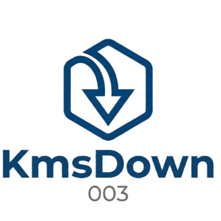

# KmsDown // SISTEMA UNITARIO DE DESCARGAS

<div align="center">
  
</div>

**KmsDown** es un manejador de descargas autónomo y avanzado construido en Python (Flask) diseñado originalmente para evadir el ciclo de interacción manual al descargar carpetas o directorios pesados desde MediaFire. A través de una inferfaz local de estética *NieR-Automata / Cyber-minimalista*, proporciona recolección automatizada, control inteligente de re-descargas y un sistema de colas totalmente auditable.

*Creado y diseñado estratégicamente por [KmsBismarck003](https://github.com/KmsBismarck003).*

---

## [ I ] Características Principales

* **Scraping Quirúrgico de Nube**: Escanea al instante enlaces de carpetas enteras de MediaFire ignorando limitantes visuales.
* **Control Selectivo Fino**: Visualiza todos los archivos (y sus pesos) antes de consumirlos. Utiliza casillas (checkboxes) para descargar únicamente las piezas de contenido requeridas.
* **Evitación Activa de Redundancia y Autocorrector**: Antes de efectuar operaciones, comprueba en tu ruta de bajada si los archivos ya existen para economizar hardware y ancho de banda local. Cuenta con función nativa de *"Re-Verificar / Reparar"* elementos corrompidos.
* **Panel Front-End Modernizado**: Una interfaz geométrica y minimalista con soporte para temas, notificaciones "Toasts" animadas y modales explicativos.
* **Microgestión Modular en Tiempo Real**: Suspende temporalmente o detiene permanentemente bytes de procesamiento. Cada conexión a un archivo se puede **Pausar u Omitir** durante su ejecución con cálculo instantáneo de la Velocidad de Descarga y Progreso (`KB/s` / `MB/s`).
* **Integración OS**: Dirígete a Windows Explorer con un sólo click usando los submódulos integrados del gestor de Carpetas locales.
* **Módulo Múltiple Adaptativo**: Si la petición de datos es genérica, el sistema enruta la petición automáticamente al motor universal yt-dlp.

---

## [ II ] Estructura del Sistema
El software fue simplificado a una arquitectura limpia de microservidor local:

* `app.py`: El corazón y columna principal del proyecto (Servidor de red, Raspado, Enrutamiento Python Flask).
* `templates/index.html`: Sistema interactivo Front-End.
* `static/script.js`: Controlador asíncrono e intercomunicador iterativo.
* `static/style.css`: Motor visual para el diseño minimalista iterativo.
* `app_data/`: Almacén local auto-generado para registros, historiales y métricas.

---

## [ III ] Instrucciones de Operación

### Dependencias y Compilación
Un entorno local con [Python 3](https://www.python.org/) y el administrador de paquetes `pip` disponible. Se recomienda tener yt-dlp funcional en compilación binaria base.

### Despliegue Rápido
1. Clona el repositorio a un directorio matriz:
   ```bash
   git clone https://github.com/KmsBismarck003/KmsDown.git
   cd KmsDown
   ```
2. Instala las ramificaciones lógicas requeridas:
   ```bash
   pip install flask requests beautifulsoup4 yt-dlp
   ```
3. Enciende el motor conmutador Unitario:
   ```bash
   python app.py
   ```
4. Dirígete en tu navegador hacia `http://127.0.0.1:5000` y prepárate.

---

## [ IV ] Licencia y Autoría
Diseñado y orquestado enteramente por Bismarck003. Código de libre inspección bajo licencia MIT. Úsese responsablemente frente a los términos de servicios estipulados por los respectivos hostings objetivo.
